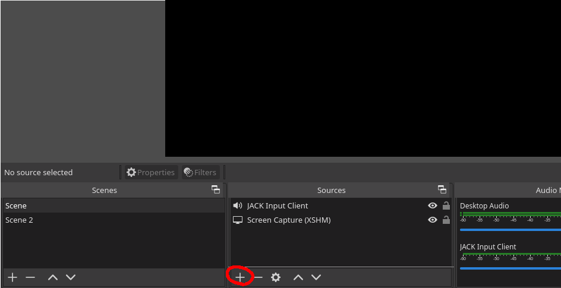
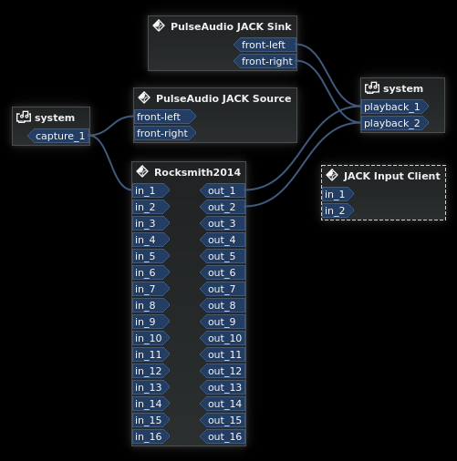

# Recording with OBS

## Quick and dirty

Works just fine.

## JACK

Start JACK first, just in case.

Open OBS. In sources, click `+` -> JACK Input Client -> Choose name. Select 2 input channels, if asked.

I recommend to disable any other system audio in OBS: Settings -> Audio -> Global Audio devices -> disable any "Desktop Audio". They created white noise on my system.

Start the game and open Catia once it's running. It will look something like this:

* `Pulse Audio JACK [...]` is from `pulseaudio-jack` (which is pretty nice to have, but not needed to get the game running)
* `system` are the input and output devices
* `JACK Input Client` is the sink from OBS we just created
* `Rocksmith2014` is the game

Now tie Rocksmith's outputs to OBS's inputs. OBS should get sound from Rocksmith now.

Have fun recording and/or streaming.
